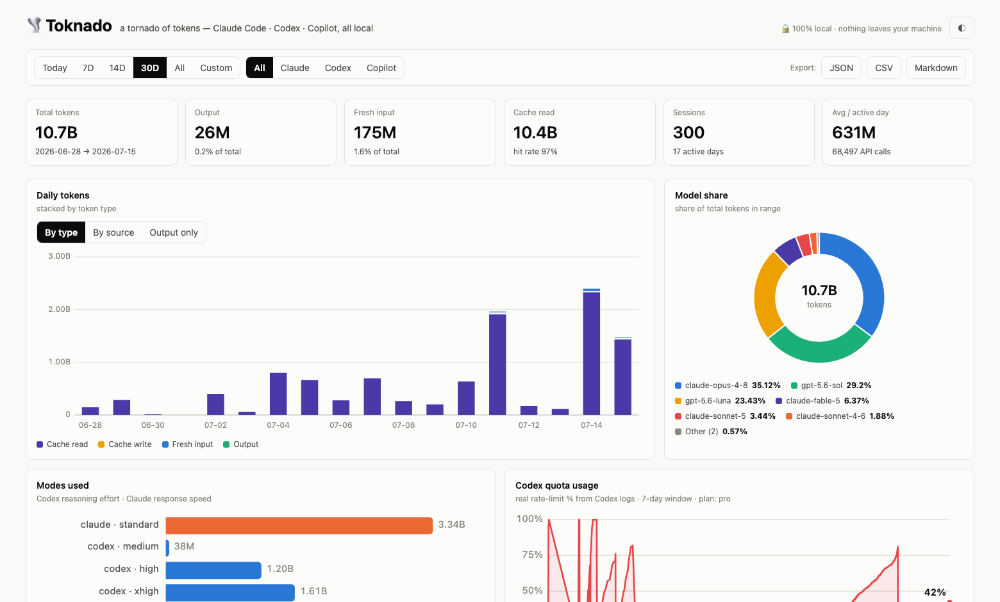

# 🌪️ Toknado

[](https://www.npmjs.com/package/toknado)
[](LICENSE)
[](package.json)
[](package.json)
[](CONTRIBUTING.md)

> **A tornado of tokens.** See exactly what your coding agents devour — Claude Code, Codex *and* GitHub Copilot Chat, one dashboard, 100% local.

<picture>
  <source media="(prefers-color-scheme: dark)" srcset="docs/screenshot-dark.png">
  
</picture>

Toknado reads the session logs that Claude Code (`~/.claude`) and Codex CLI (`~/.codex`) already write to your machine, and turns them into a fast local dashboard. No accounts, no uploads, no telemetry, no database. Close the tab and nothing remains but your logs.

```
npx toknado
```

That's it. Your dashboard opens at `http://127.0.0.1:4141`.

## What you get

- **📊 One dashboard for all your agents** — Claude Code, Codex CLI and GitHub Copilot Chat (VS Code), merged or filtered per source
- **🔬 Every model, every call** — the All-models table lists each model with API-call counts, avg tokens/call and full usage breakdown
- **📅 Every range you'd ever ask for** — today, 7 / 14 / 30 days, all time, or a custom date range
- **📈 Charts, not spreadsheets** — daily stacked bars (by token type or source), model share donut, activity heatmap, busy-hours histogram
- **🤖 Per-model breakdown** — which model ate how much, with share percentages
- **🧠 Modes visible** — Codex reasoning efforts (`medium` / `high` / `xhigh` / `max` / `ultra`) and Claude response speeds (`standard` / `fast`)
- **📉 Real quota tracking** — Codex logs its rate-limit `used_percent`; Toknado charts your actual weekly quota consumption over time
- **% of everything** — every day, session, model, and project shows its share of total usage
- **🧾 Top sessions leaderboard** — which sessions and projects burned the most
- **💸 What-if API cost comparison** — what your token mix *would* cost at public API list prices, across model tiers (clearly labeled hypothetical — subscriptions don't bill per token)
- **📡 Live pricing (opt-in)** — `--live-pricing` fetches current rates for thousands of models from [LiteLLM's public price DB](https://github.com/BerriAI/litellm), so even brand-new models get priced
- **📤 Export on demand** — JSON, CSV, or Markdown. Nothing is saved unless *you* export it

## Privacy model

| Question | Answer |
|---|---|
| Where does my data go? | Nowhere. The server binds to `127.0.0.1` only. The single exception: with the opt-in `--live-pricing` flag, Toknado makes one plain GET to LiteLLM's public price file — it carries nothing about you. |
| What does Toknado store? | Nothing. Every view is recomputed from your logs in memory. |
| What if I close it without exporting? | Nothing is saved — and nothing is lost. Reopen it and the same history is there, because your CLI logs *are* the data. |
| Can it modify my logs? | No. Logs are opened read-only. |

## How it works

- **Claude Code** writes one JSONL file per session under `~/.claude/projects/`. Each assistant turn records exact API `usage` (input / output / cache read / cache write) per model. Toknado deduplicates entries that appear in multiple files (forked / resumed sessions).
- **Codex CLI** writes rollout JSONL files under `~/.codex/sessions/`. Forked/subagent files copy the parent's entire history with rewritten timestamps — Toknado deduplicates on usage snapshots so each API call counts exactly once, reads model + reasoning effort from `turn_context`, and collects the `rate_limits.used_percent` samples for the quota chart.
- **GitHub Copilot Chat** (VS Code) stores per-session operation logs under the editor's `workspaceStorage/*/chatSessions/`. Toknado replays the op log to recover each request's `promptTokens`/`completionTokens`, model and timestamp (Code, Insiders and VSCodium are auto-detected).

Token counts come straight from the logs — they're exact. Dollar figures in the comparison panel are **estimates** from public list prices.

## Usage

```
npx toknado [options]

  -p, --port <n>        port to serve on (default 4141)
  --no-open             don't auto-open the browser
  --claude-dir <path>   Claude Code projects dir (default ~/.claude/projects)
  --codex-dir <path>    Codex home dir (default ~/.codex)
  --copilot-dir <path>  VS Code workspaceStorage dir for Copilot Chat
  --pricing <file>      JSON file with per-Mtok price overrides
  --live-pricing        fetch current API list prices from LiteLLM's public DB
                        (the only network request Toknado can ever make; off by default)
```

### Custom pricing

Models Toknado doesn't know show `n/a` in the cost panel. Provide your own rates (USD per million tokens, prefix-matched against model IDs):

```json
{
  "gpt-5.6": { "input": 1.25, "output": 10 },
  "my-local-model": { "input": 0, "output": 0 }
}
```

```
npx toknado --pricing my-prices.json
```

## Non-goals

- **Not a spend tracker.** Subscription plans don't bill per token; Toknado is tokens-first everywhere, and the single cost panel is explicitly hypothetical.
- **Not a sync service.** There is no cloud, and there never will be.

## Requirements

Node.js ≥ 18. Zero dependencies.

## Contributing

Contributions are very welcome — see [CONTRIBUTING.md](CONTRIBUTING.md). Good first areas: new log formats (other agent CLIs), chart ideas, and pricing-table updates.

## License

MIT
